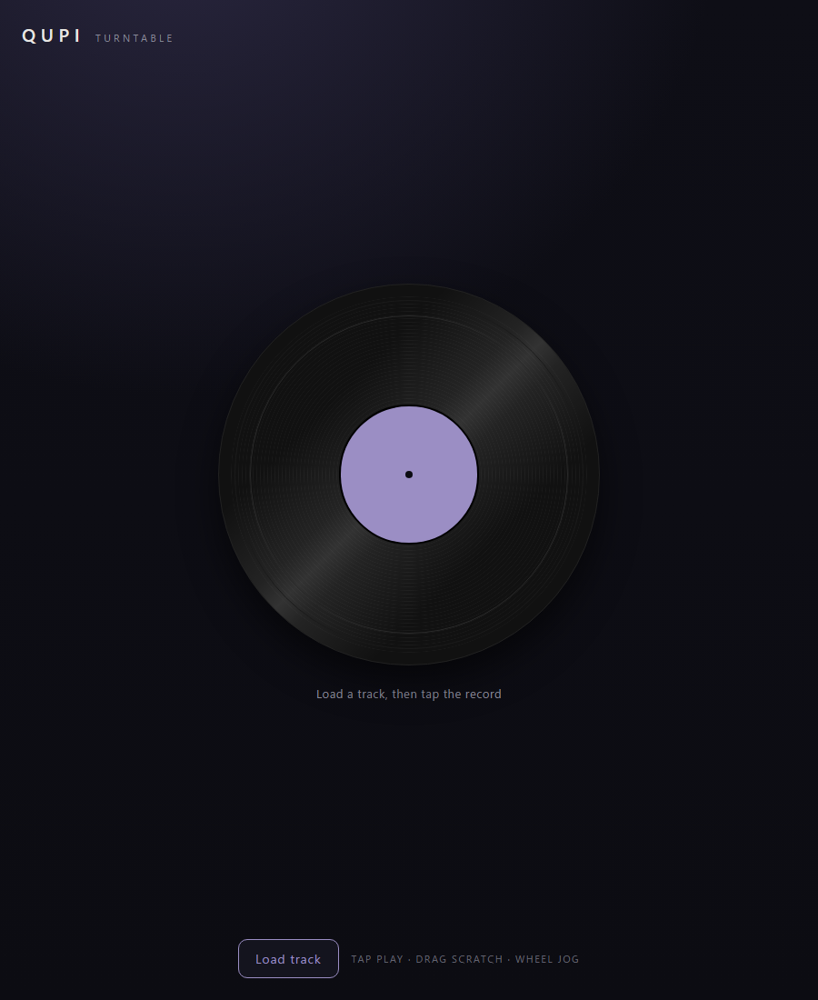

# QUPI

**A scratchable turntable in your browser.** Load a track, spin the record, and
scratch it — slow it and the pitch drops, shove it and it reverses, stop it and it
fades to silence. Works on the desktop and the phone.

[](https://nisesimadao.github.io/Qupi/)
[](https://github.com/nisesimadao/Qupi/actions/workflows/pages.yml)
[](#develop)



[日本語版READMEはこちら](./README_jp.md)

Qupi's one idea: **rotation is the truth; the sound follows the spin.** The
record's angular velocity is the only real state, and the audio is played back at
`velocity ÷ reference` — nothing chases the sound; everything follows the platter.

The audio runs entirely in an `AudioWorklet` (a variable-speed playback head) with
no `SharedArrayBuffer`, so it hosts as plain static files on GitHub Pages.

> The **native / handheld** edition — for the Trimui Brick, desktops, and the
> Raspberry Pi, with a software-rendered UI and gamepad controls — is its Rust
> sibling, [Qupi-Rust](https://github.com/nisesimadao/Qupi-Rust).

## At a Glance

- **Scratch any track** — drop in an audio file and work the record.
- **True turntable feel** — real pitch bend and reverse from the spin, not an
  effect bolted on top.
- **Runs anywhere** — a tiny static site (a few kB of JS), so it opens instantly
  in any modern browser, mobile included.
- **No install, no permissions** — just a URL.

## Controls

- **Tap** the record to play / stop.
- **Drag** it to scratch (down / left = forward, up / right = rewind).
- **Wheel** to jog.

## Develop

```sh
npm install
npm run dev
```

## Build

```sh
npm run build   # → dist/
```

`.github/workflows/pages.yml` builds and publishes `dist/` to GitHub Pages on every
push to `main`.

## Credits

- **[Vite](https://vite.dev/)** — build tooling (MIT).
- The turntable physics and the `scratch-processor` AudioWorklet are adapted from
  the nisesimadao portfolio.
