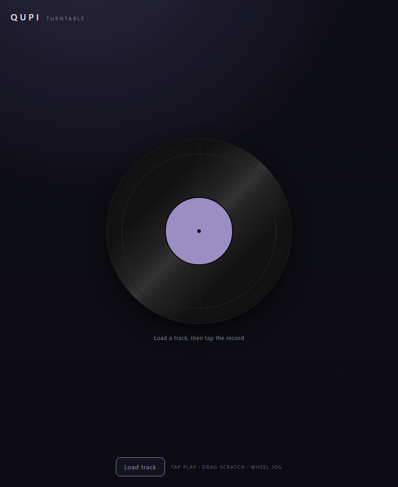

# QUPI

Qupi は、ブラウザ上で音声ファイルをスクラッチ再生できるターンテーブルです。
レコードを回す速度に応じて再生速度とピッチが変わり、逆方向へ回すと逆再生します。
PC とスマートフォンのブラウザで動作します。

[](https://nisesimadao.github.io/Qupi/)



[English README](./README.md)

Qupi では、レコードの角速度を再生状態の基準にしています。
音声の再生速度は常に `角速度 ÷ 基準速度` で決まり、UI と音声の両方が同じ回転状態を参照します。

音声処理には `AudioWorklet` を使用し、可変速の再生ヘッドを実装しています。
`SharedArrayBuffer` は使用しないため、GitHub Pages に静的ファイルとして配置できます。

> Trimui Brick、デスクトップ、Raspberry Pi 向けのネイティブ版は、Rust で実装した兄弟プロジェクト [Qupi-Rust](https://github.com/nisesimadao/Qupi-Rust) です。
> ソフトウェア描画 UI とゲームパッド操作を使用します。

## 特徴

- **音声ファイルのスクラッチ**：読み込んだ音声をレコード操作で再生できます。
- **回転速度に基づく再生**：追加エフェクトではなく、レコードの回転速度からピッチベンドと逆再生を生成します。
- **静的 Web アプリ**：JavaScript を中心とした小規模な構成で、モバイルブラウザにも対応します。
- **追加権限不要**：対応ブラウザから URL を開いて使用できます。

## 操作

- レコードを**タップ**すると再生と停止を切り替えます。
- **ドラッグ**するとスクラッチできます。
  下または左方向は順方向、上または右方向は巻き戻しです。
- **ホイール**でジョグ操作ができます。

## 開発とビルド

```sh
npm install
npm run dev      # 開発サーバ
npm run build    # dist/ を生成(Pages へ自動デプロイ)
```

## クレジット

- **[Vite](https://vite.dev/)**：ビルドツール（MIT）。
- ターンテーブルの物理処理と `scratch-processor` AudioWorklet は、nisesimadao の既存実装を基にしています。
